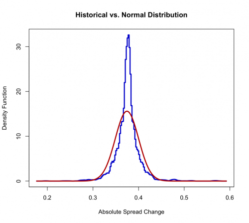

[](http://quantlet.de/)

## [](http://quantlet.de/) **XFGdist** [](http://quantlet.de/)

```yaml

Name of QuantLet: XFGdist


Published in: Applied Quantitative Finance


Description: 'Plots empirical vs. normal distribution. 
We visualize symmetry and leptokursis of the distribution of absolute spread
changes for the INAAA 10Y data, where we plot the empirical
distribution of absolute spreads around the mean spread in an averaged
shifted histogram and the normal distribution with the variance estimated
from historical data.'


Keywords: plot, empirical, normal, histogram, visualization


Author: Germar Knoechlein, Awdesch Melzer


Submitted: Sat, June 16 2012 by Dedy Dwi Prastyo


Datafile: XFGINAAA.dat, XFGUSTF.dat


```



### R Code
```r

# clear variables and close windows
rm(list=ls(all=TRUE))
graphics.off()

# load library
install.packages("ash")
library(ash)

# load data
USTF  = read.table("XFGUSTF.dat")
INAAA = read.table("XFGINAAA.dat")
  
# extract variables M3:Y10 and compute yield difference between government USTF and industry INAAA yields  
SINAAA = INAAA[,4:12]-USTF[,4:12]

# compute returns  
DASIN01AAA = SINAAA[2:nrow(SINAAA),]-SINAAA[1:(nrow(SINAAA)-1),]

# compute dummy time variable
xmin = 60
xmax = nrow(SINAAA)
x    = (xmin:xmax)


m  = mean(SINAAA[xmin:xmax,9])         # compute mean
v  = var(DASIN01AAA[xmin:xmax-1,9])    # compute variance
s  = sqrt(v)                           # standard deviation
p  = matrix(1,(length(x)),1)           # vector of ones
p  = p*m                               # vector of means
g  = p+cbind(DASIN01AAA[xmin:xmax-1,9])# adding returns
gr = ash1(bin1(g,nbin=200))            # compute averaged shifted histogram
n  = exp(-((gr$x-m)^2)/2/v)            # compute normal density
n  = n/s/sqrt(2)/sqrt(pi)
gn = cbind(gr$x,n)
  

plot(gr,type="s",col="blue3", lwd=3, main="Historical vs. Normal Distribution", xlab="Absolute Spread Change", ylab="Density Function", axes=F, frame=T)
axis(side=1,at=seq(0,1,0.1),labels=seq(0,1,0.1))
axis(side=2,at=seq(0,30,10),labels=seq(0,30,10))
lines(gn,col="red3", lwd=3)
  
```

automatically created on 2018-05-28