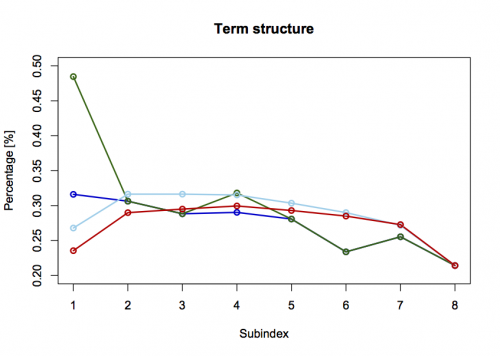

[](http://quantlet.de/)

## [](http://quantlet.de/) **XFGiv03** [](http://quantlet.de/)

```yaml

Name of QuantLet: XFGiv03

Published in: Applied Quantitative Finance

Description: 'XFGiv03 shows the term structure of implied volatility indices. These indices, representing different option maturities, measure volatility implied in ATM European call and put options. The VDAX calculations are based on Black and Scholes formula. Term structures for ATM DAX options can be derived from VDAX subindices for any given trading day since 18 March 1996. Shapes of the term structure on subsequent trading days are shown in a plot. If we compare the volatility structure of 27 October 1997 (blue line) with that of 28 Octorber 1997 (green line), we easily notice an overnight upward shift in the levels implied volatilities. In addition, it displays an inversion as short term volatilities are higher than long term ones. Only a couple of weeks later, on 17 November (skyblue line) and 20 November (red line), the term structure had normalized at lower levels and showed its typical shape again. Apparently, during the market tumble in fall 1997, the ATM term structure shifted and changed its shape considerably over time.'

Keywords: 'black-scholes, call, european-option, implied-volatility, option, option-price, put, term structure'

See also: 'XFGLSK, XFGiv00, XFGiv01, XFGiv02, XFGiv04, XFGiv05, XFGiv06'

Author: Awdesch Melzer

Submitted: Wed, May 28 2014 by Awdesch Melzer

Datafiles: XFGIVTermStructure.dat

```



### R Code
```r

# clear cache and close graphs
rm(list=ls(all=TRUE))
graphics.off()

# setwd("C:/...")

x  = read.table("XFGIVTermStructure.dat") # load data

x1 = cbind(1:8,x[,1])                    # prepare for plotting
x2 = cbind(1:8,x[,2])
x3 = cbind(1:8,x[,3])
x4 = cbind(1:8,x[,4])

plot(x1,type="l",col="blue3",ylim=c(0.20,0.5),lwd=2,xlab="Subindex",ylab="Percentage [%]")
lines(x2,col="darkgreen",lwd=2)
lines(x3,col="skyblue",lwd=2)
lines(x4,col="red3",lwd=2)
title("Term structure")
points(x1,pch=1,col="blue3",lwd=2)         # setting points
points(x2,pch=1,col="darkgreen",lwd=2)
points(x3,pch=1,col="skyblue",lwd=2)
points(x4,pch=1,col="red3",lwd=2)
```

automatically created on 2018-05-28