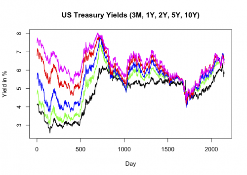

[](http://quantlet.de/)

## [](http://quantlet.de/) **XFGtreasury** [](http://quantlet.de/)

```yaml

Name of QuantLet: XFGtreasury

Published in: Applied Quantitative Finance

Description: 'Plots US Treasury Yields (3M, 1Y, 2Y, 5Y, 10Y) from 0 to 2000 days'

Keywords: plot, financial, data visualization, yield, treasury

Author: 'Germar Knoechlein, Awdesch Melzer'

Submitted: Sat, June 16 2012 by Dedy Dwi Prastyo

Datafiles: XFGUSTF.dat
```



### R Code
```r

# clear variables and close windows
rm(list = ls(all = TRUE))
graphics.off()

# load data
USTF = read.table("XFGUSTF.dat")

# first observation point
xmin = 1

# last observation point
xmax = nrow(USTF)

# observation dummy
x = (xmin:xmax)

# plot of treasuries
z1 = plot(x, USTF[xmin:xmax, 4], type = "l", col = "black", lwd = 1.5, xlab = "Day", ylab = "Yield in %", axes = FALSE, frame = TRUE, 
    ylim = c(2.5, 8), main = "US Treasury Yields (3M, 1Y, 2Y, 5Y, 10Y)")  # 3 month yield
axis(side = 1, at = seq(0, 2000, 500), labels = seq(0, 2000, 500))
axis(side = 2, at = seq(0, 10, 1), labels = seq(0, 10, 1))
z2 = lines(x, USTF[xmin:xmax, 6], col = "green", lwd = 1.5)  # 1 year yield
z3 = lines(x, USTF[xmin:xmax, 7], col = "blue", lwd = 1.5)  # 2 year yield
z4 = lines(x, USTF[xmin:xmax, 10], col = "red", lwd = 1.5)  # 5 year yield
z5 = lines(x, USTF[xmin:xmax, 12], col = "magenta", lwd = 1.5)  # 10 year yield 

```

automatically created on 2018-05-28