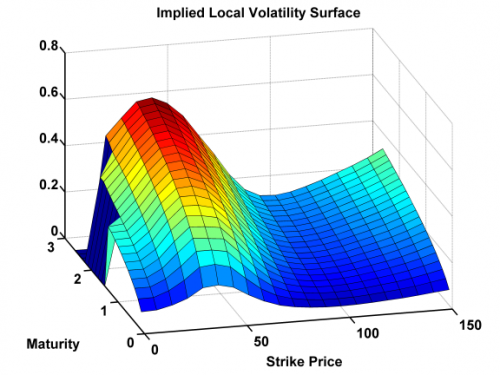
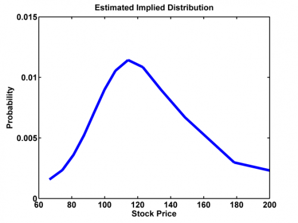

[](http://quantlet.de/)

## [](http://quantlet.de/) **XFGIBT02** [](http://quantlet.de/)

```yaml


Name of Quantlet: XFGIBT02 

Published in: Applied Quantitative Finance

Description: 'Plots an estimated state price density of the stock prices estimated by implied binomial tree and plots the estimated implied local volatility surface. Require IBTbc.m, IBTdk.m, IBTimpliedvola.m, IBTblackscholes.m, IBTcrr.m, IBTlocsigma.m, IBTsdisplot.m, IBTvolaplot.m, regxest.m,'

Keywords: implied, binomial tree, blackscholes, options

See also: IBTbc, IBTblackscholes, IBTcrr, IBTdk, IBTimpliedvola, IBTlocsigma, IBTsdisplot, IBTvolaplot, XFGLSK, XFGSPDcb2, XFGSPDcom, regxest

Author: Jun Zheng, Alena Mysickova

Submitted: 2012-07-27 by Dedy Dwi Prastyo

Datafiles: XFGIBT02.asv

Example: '1.png, 2.png'

```





### MATLAB Code
```matlab

%% Code

disp('Please input Price of Underlying Asset s0, Riskless Interest Rate per Year r');
disp('Time to Expiration (Years) t, Number of steps n');
disp('as: [100, 0.03, 5, 40]');
disp(' ') ;
para=input('[s0, r, t, n]=');
while length(para) < 4
  disp('Not enough input arguments. Please input in 1*4 vector form like [100, 0.03, 5, 5]');
  disp(' ') ;
  para=input('[s0, r, t, n]=');
end
s0=para(1);             % Stock price
r=para(2);              % Riskless interest rate   
t=para(3);              % Time to expiration
n=para(4);              % Number of intervals format short
[St, AD, P, LV] = IBTcdk(s0,r,t,n,[]);          % Derman & Kani
%[St, AD, P, LV] = IBTbc(s0,r,t,n,[]);         % Barle & Cakici    
dat=[St(:,n+1) (AD(:,n+1)*exp(r*t))];
bandwidth=20;
in = find(dat(:,2)>0.005);
dat = dat(in,:);

%% Plot

figure(1)
IBTsdisplot(dat, bandwidth); % Density plot
%%%%%%%%%%%%%%%%%%%%%%%%%%%%%%%%%%%%%%%%%%%%%%%%%%%%%%%
deltat=t/n;
[loc,lv,strike,mat]=IBTlocsigma(St, P, n, deltat);
startpoint=0
endpoint=150
figure(2)
IBTvolaplot(loc,deltat,startpoint,endpoint,20); % Implied local volatility surface
```

automatically created on 2018-05-28